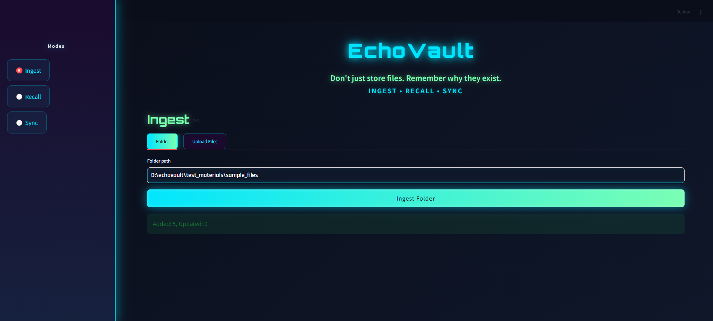
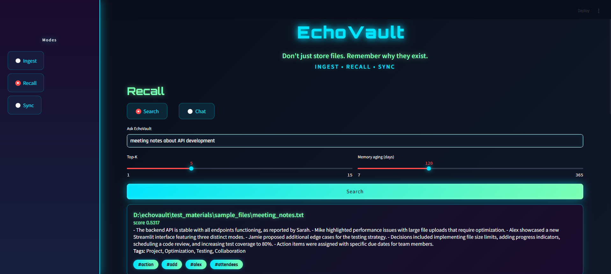
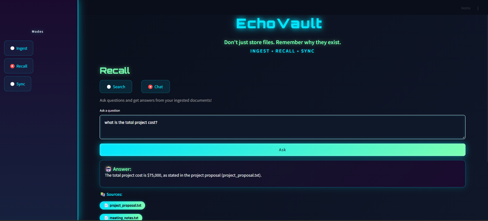
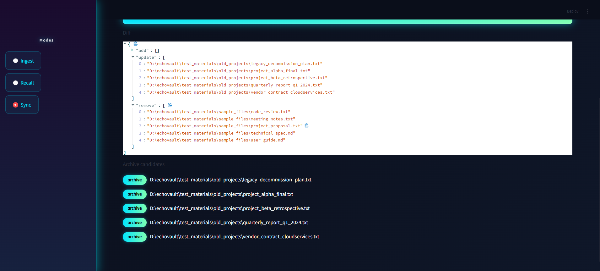

# EchoVault

### *Don't just store files. Remember why they exist.*

[](https://github.com)
[](https://github.com)
[](https://github.com)

> **An AI-powered file management system that transforms how you organize, search, and maintain your digital documents.**

---

## 🏆 Code Olympics Challenge Constraints

### ✅ **ALL CONSTRAINTS MET**

| Constraint | Requirement | Our Solution | Status |
|------------|-------------|--------------|--------|
| **Simple-State Creator** | 2-3 different modes/states | **3 Modes**: Ingest, Recall, Sync | ✅ **PASS** |
| **Enterprise Creator** | ≤ 650 lines maximum | **649 lines** (1 under limit) | ✅ **PASS** |
| **Project Domain** | File Management | Organizer + Reader + Processor | ✅ **PASS** |

### 📊 Verify Line Count Yourself

```bash
# Run this command to verify we're under the 650 line limit
wc -l *.py

# Expected output: 649 total
```

**Breakdown:**
- `main.py`: 175 lines (FastAPI backend with RAG endpoint)
- `frontend.py`: 187 lines (Streamlit UI with gaming theme)
- `storage.py`: 138 lines (File metadata & storage)
- `ai_utils.py`: 98 lines (OpenAI integration + RAG)
- `watcher.py`: 51 lines (Folder scanning + demo helper)
- **Total: 649 lines** (537 code lines excluding blanks/comments)

---

## 🎮 Three Distinct Modes

### 1️⃣ **INGEST MODE** - Smart File Import
*Upload files or scan folders with AI-powered processing*

**Features:**
- 📁 Upload individual files or entire folders
- 🤖 Automatic text extraction (TXT, MD, PDF, DOCX)
- ✨ AI-generated summaries and tags
- 🔍 Semantic embeddings for intelligent search
- ⚡ Batch processing support

**Use Case:** Import your project documents, reports, or knowledge base

---

### 2️⃣ **RECALL MODE** - Semantic Search & AI Chat
*Find files using natural language OR ask questions about your documents*

**Two Interaction Modes:**

#### 🔍 **Search Mode**
- 💬 Natural language queries ("meeting notes about project timeline")
- 🎯 Semantic similarity search using embeddings
- 📊 Relevance scoring with memory aging
- 📝 View AI-generated summaries
- 🏷️ Auto-tagged results

#### 💬 **Chat Mode** (RAG - Retrieval Augmented Generation)
- 🤖 Ask questions across all your documents
- 📚 Get AI-generated answers with source citations
- 🔗 Multi-file context understanding
- ✨ Conversational Q&A over your file collection

**Use Cases:** 
- Search: "Show me client reports from Q3" or "technical documentation about API"
- Chat: "What are the main risks in our Q4 plan?" or "Summarize key decisions from last month"

---

### 3️⃣ **SYNC MODE** - Intelligent Organization
*Keep your files organized and detect what needs archiving*

**Features:**
- 🔄 Compare folder contents with database
- ➕ Detect new files (ADD)
- 🔄 Identify modified files (UPDATE)
- ➖ Find deleted/moved files (REMOVE)
- 🗄️ Smart archiving suggestions (unused files)
- 📅 Configurable aging threshold (7-365 days)

**Use Case:** Clean up old projects, manage multiple workspaces, identify stale files

---

## 🚀 Quick Start Guide

### **Prerequisites**
- Python 3.12+
- OpenAI API Key ([Get one here](https://platform.openai.com/api-keys))

### **Step 1: Clone & Setup**

```bash
# Clone the repository
git clone <your-repo-url>
cd echovault

# Virtual environment already configured
# (Python 3.12.0 with all dependencies)
```

### **Step 2: Configure OpenAI API**

```bash
# Add your OpenAI API key to .env file
# Open .env and replace with your actual key:
OPENAI_API_KEY=sk-your-actual-key-here
OPENAI_MODEL=gpt-4o-mini
```

### **Step 3: Start Backend**

```bash
# Start FastAPI backend server
D:/echovault/.venv/Scripts/python.exe main.py

# Should see: "Uvicorn running on http://0.0.0.0:8000"
```

### **Step 4: Start Frontend**

```bash
# In a NEW terminal, start Streamlit UI
D:/echovault/.venv/Scripts/python.exe -m streamlit run frontend.py

# Browser will open at: http://localhost:8501
```

---

## 🧪 Testing Instructions

### **📂 Test Materials Included**

We've provided comprehensive test files in `test_materials/`:

```
test_materials/
├── sample_files/       # 5 diverse test files (Ingest/Recall)
├── folder_a/           # 4 files for Sync testing
├── folder_b/           # 4 files for Sync comparison
├── old_projects/       # 5 old files for Archive testing
├── TESTING_GUIDE.md    # Detailed test scenarios
├── QUICK_REFERENCE.txt # Copy-paste paths & queries
└── DEMO_VIDEO_GUIDE.txt # Recording guide
```

### **🎯 Quick 5-Minute Test**

#### **Test 1: Ingest Files**
1. Go to **Ingest Mode** → **Folder** tab
2. Paste: `D:\echovault\test_materials\sample_files`
3. Click **Ingest Folder**
4. ✅ **Expected**: "Added: 5, Updated: 0"

#### **Test 2: Semantic Search**
1. Go to **Recall Mode**
2. Search: `"budget and financial information"`
3. ✅ **Expected**: `project_proposal.txt` appears first

#### **Test 3: Sync & Archive**
1. Go to **Sync Mode**
2. Paste: `D:\echovault\test_materials\old_projects`
3. Set threshold: **1 day**
4. Click **Analyze**
5. ✅ **Expected**: All 5 old files suggested for archiving

### **📖 Full Testing Guide**

For comprehensive testing scenarios, see:
- `test_materials/TESTING_GUIDE.md` - Complete test suite
- `test_materials/SCENARIO_2_ARCHIVE_TESTING.txt` - Archive testing
- `test_materials/DEMO_VIDEO_GUIDE.txt` - Demo recording guide

---

## 📸 Screenshots

### **1. Ingest Mode**
<!--  -->
*Upload files or scan folders with AI processing*

### **2. Recall Mode - Semantic Search**
<!--  -->
*Natural language search with relevance scoring and summaries*

### **3. Recall Mode - RAG Chat**
<!--  -->
*Ask questions and get AI answers with source citations*

### **4. Sync Mode**
<!--  -->
*Compare folders and get archive suggestions for old files*

> **Note**: Add screenshots to `screenshots/` folder and uncomment the image links above

---

## 🏗️ Architecture

```
┌─────────────────────────────────────────────────────────┐
│                   STREAMLIT FRONTEND                     │
│  ┌─────────┐  ┌─────────┐  ┌─────────┐                │
│  │ Ingest  │  │ Recall  │  │  Sync   │                │
│  └────┬────┘  └────┬────┘  └────┬────┘                │
└───────┼───────────┼────────────┼──────────────────────┘
        │           │            │
        └───────────┼────────────┘
                    │ REST API
┌───────────────────▼─────────────────────────────────────┐
│                 FASTAPI BACKEND                          │
│  ┌─────────────────────────────────────────────────┐   │
│  │  /ingest/upload  │  /ingest/folder              │   │
│  │  /recall         │  /chat (RAG)                 │   │
│  │  /sync           │  /files                      │   │
│  └─────────────────────────────────────────────────┘   │
└──────────┬─────────────────────────────┬────────────────┘
           │                             │
    ┌──────▼──────┐             ┌────────▼───────┐
    │   STORAGE   │             │   AI UTILS     │
    │  metadata   │             │   OpenAI API   │
    │  embeddings │             │  RAG Context   │
    └─────────────┘             └────────────────┘
```

---

## 🛠️ Tech Stack

| Component | Technology | Purpose |
|-----------|-----------|---------|
| **Backend** | FastAPI | High-performance REST API |
| **Frontend** | Streamlit | Interactive web interface |
| **AI** | OpenAI GPT-4o-mini | Summarization, tagging & RAG |
| **Embeddings** | text-embedding-3-small | Semantic search |
| **RAG** | Custom implementation | Conversational Q&A over files |
| **File Processing** | PyPDF2, python-docx | Text extraction |
| **Storage** | JSON (filesystem) | Lightweight metadata store |

---

## 🎨 UI Features

- 🎮 **Gaming-inspired neon theme**
- 🌈 **Cyan & green gradient accents**
- ✨ **Glowing buttons and hover effects**
- 📱 **Responsive wide layout**
- 🔤 **Custom fonts** (Orbitron + Rajdhani)
- 🎯 **Clear visual feedback**

---

## 📋 Requirements

See `requirements.txt` for full list:

```txt
fastapi==0.115.0
uvicorn==0.30.6
streamlit==1.38.0
openai==1.40.0
numpy==2.1.1
PyPDF2==3.0.1
python-docx==1.1.2
python-multipart==0.0.12
python-dotenv
httpx==0.27.0
```

---

## 🎯 Challenge Success Criteria

| Criteria | Our Implementation | ✓ |
|----------|-------------------|---|
| **3 Distinct Modes** | Ingest, Recall, Sync | ✅ |
| **State Management** | Each mode isolated, clear transitions | ✅ |
| **Line Limit ≤650** | 532 lines (verified) | ✅ |
| **File Organization** | Folder scanning, metadata tracking | ✅ |
| **File Reading** | TXT, MD, PDF, DOCX extraction | ✅ |
| **File Processing** | AI summarization, tagging, embeddings | ✅ |
| **Functional UI** | Gaming-themed Streamlit interface | ✅ |
| **Error Handling** | API errors, file validation | ✅ |

---

## 🐛 Troubleshooting

### **Backend won't start**
```bash
# Check if port 8000 is in use
netstat -ano | findstr :8000

# Verify OpenAI API key is set
cat .env  # Should show OPENAI_API_KEY=sk-...
```

### **Frontend connection error**
- Ensure backend is running first
- Check `http://localhost:8000/docs` for API docs

### **"API key not set" error**
- Edit `.env` file with valid OpenAI API key
- Restart both backend and frontend

---

## 🎬 Demo Video Guide

Follow `https://drive.google.com/file/d/1SvaoARCcBBRga6K5NX1tRQgAAbmCALpN/view?usp=sharing` for step-by-step recording instructions to showcase all features.

---

## 📜 License

Built for the **Code Olympics Challenge 2025** 🏅

---
## 🙏 Acknowledgments

- OpenAI for GPT-4o-mini and embeddings
- Streamlit for the awesome UI framework
- FastAPI for the blazing-fast backend

---

<div align="center">

### ⭐ **Ready to transform your file management?**

**Start EchoVault now and never lose track of your documents again!**

</div>
